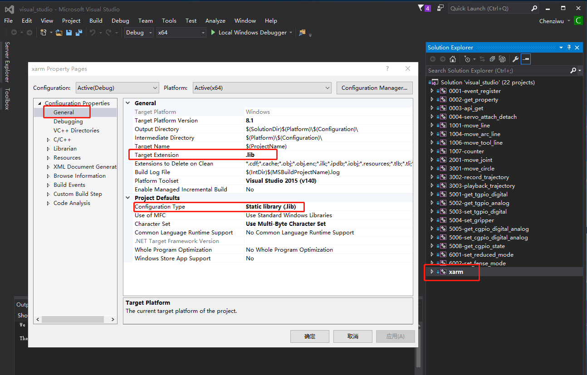
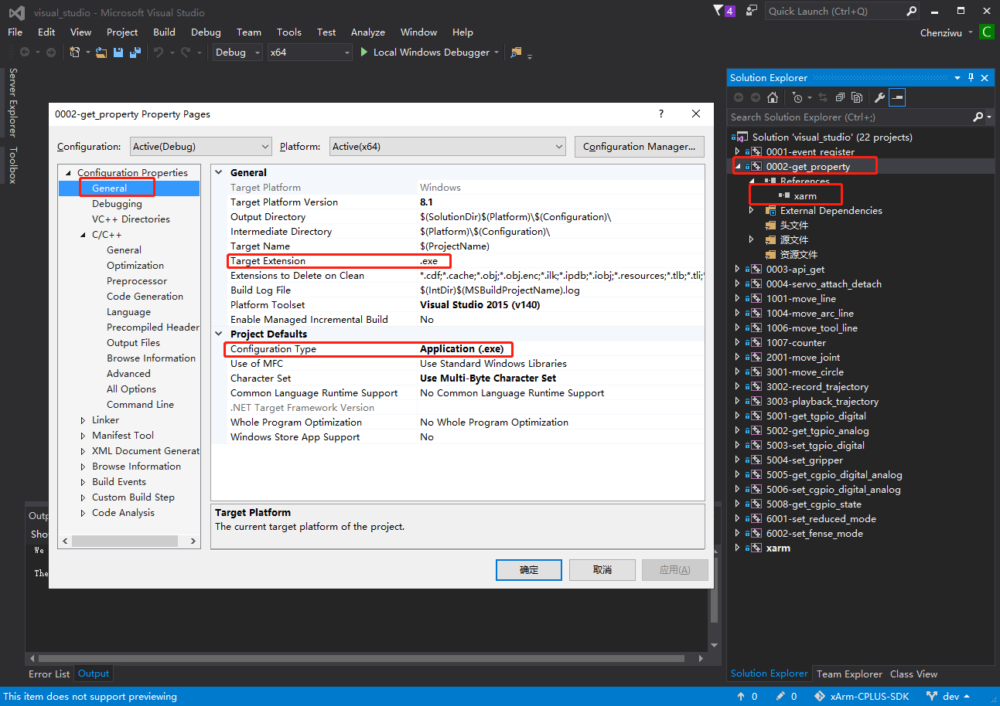

# xArm-C++-SDK


## Overview
- The current version supports Linux/windows/MacOS(beta), but the source code structure has changed.

## Caution
- During use, people should stay away from the robot arm to avoid accidental injury or damage to other items by the robot arm.
- Protect the arm before use.
- Before you exercise, please make sure you don't encounter obstacles.
- Protect the arm before unlocking the motor.

## Update Summary
- > ### 1.8.4
  - Support the Six-axis Force Torque Sensor (not a third party)
  - Modify the reporting processing logic and optimize the processing of sticky packets
  - Fixed frequent switching of the pause state causing the program to hang
  - Fix the program hangs when setting the mechanical claw position in speed mode


- > ### 1.8.0

  - The Velocity interface supports the duration parameter (requires firmware 1.8.0 or higher)
  - Added identification interface (current identification and torque identification) (requires firmware 1.8.0 or higher)
  - Support linear track interface (requires firmware 1.8.0 or higher)
  - Fix the problem of not waiting when the timeout parameter of the motion interface is greater than 0
  - Support macos compilation
  - Fix some bugs

- > ### 1.6.9
  - Support velocity control
  - Support calibrate tcp offset and user offset
  - Fix several bugs

- > ### 1.6.0

  - Support the xArm BIO gripper, Robotiq 2F-85 gripper and Robotiq 2F-140 gripper
  - Support position detection trigger the controller analog IO
  - Support self-collision model parameter setting
  - Support Modbus communication of end tools
  - Supports TCP timeout for setting instructions
  - Support joint motion with circular interpolation
  - Optimize logic, enhance API security, Fix several bugs

- > ### 1.5.0
  - The new parameter of `set_servo_cartisian` interface is used to support servo cartisian movement of tool coordinate system
  - Support delayed trigger digital IO
  - Support position detection trigger digital IO
  - Support configure the stop state to automatically reset IO signal
  - Support motion commands based on axis angle
  - Support to calculate the offset between two points
  - Support for blocky code conversion and operation of xArmStudio1.5.0


## Linux

- Get the code:

  ```
  git clone https://github.com/xArm-Developer/xArm-CPLUS-SDK.git
  ```

- Change directory

  ```
  cd ./xArm-CPLUS-SDK/
  ```


- Build library:
  ```bash
  make xarm
  ```

- Build all example

    ```bash
    make test
    ```

- Build a example

    ```bash
    make test-0002-get_property # build example/test-0002-get_property.cc
    ```

- Build all (build library and build all example)

    ```bash
    make clean
    make # make xarm && make test
    ```

- Install

    ```bash
    sudo make install
    ```

- Uninstall

    ```bash
    sudo make uninstall
    ```

- Run a example

    ```bash
    ./build/example/0002-get_property 192.168.1.221
    ```


## Windows

- Running environment

  ```
  It is recommended to run the project with visual studio 2015.Make sure your visual studio 2015 has a visual C++ development environment installed before running.
  ```
  
- Get the code:

  ```
  git clone https://github.com/xArm-Developer/xArm-CPLUS-SDK.git
  ```

- Change directory

  ```
  Change your directory xArm-CPLUS-SDK/visual_studio
  ```

- Open project

  ```
  If you changed your directory, you can see a visual_studio.sln file. Click this file you will open the project.
  ```


- Check the xarm project properties

  ```markdown
  Open the xarm property pages and make sure your project configuration is the same as the following screenshot configuration.
  
  VC++ Directories path 
  	$(ProjectDir)..\..\include
  	$(ProjectDir)..\..\src
  ```

  

  

  

- Check the example project properties

  ```markdown
  Open the example property pages and make sure your project configuration is the same as the following screenshot configuration.
  Example project dependencies and xarm projects so references must be added to run.
  ```
  

  


- Build project

  ```markdown
  Right click example project and build the projiect.If the example project bulid successful you will get a .exe file in you project path.
  
  .exe path like this C:\Users\ufactory\Desktop\xArm-CPLUS-SDK\visual_studio\x64\Debug\0002-get_property.exe
  ```

  


- Run project

  ```markdown
  You can use cmd run project.  
  ```

  

- New project

  ```markdown
  If you want to create a new project, you need to pay attention to the dependent path of your new project. 
  You must make sure that the configuration of the project you create is the same as that of the example project.
  ```


## [Example](example/)

- ##### [0001-event_register](example/0001-event_register.cc)

- ##### [0002-get_property](example/0002-get_property.cc)

- ##### [0003-api_get](example/0003-api_get.cc)

- ##### [0004-servo_attach_detach](example/0004-servo_attach_detach.cc)

- ##### [1001-move_line](example/1001-move_line.cc)

- ##### [1004-move_arc_line](example/1004-move_arc_line.cc)

- ##### [1006-move_tool_line](example/1006-move_tool_line.cc)

- ##### [1007-counter](example/1007-counter.cc)

- ##### [1008-move_line_aa](example/1008-move_line_aa.cc)

- ##### [1009-cartesian_velocity_control](example/1009-cartesian_velocity_control.cc)

- ##### [2000-joint_velocity_control](example/2000-joint_velocity_control.cc)

- ##### [2001-move_joint](example/2001-move_joint.cc)

- ##### [3001-move_circle](example/3001-move_circle.cc)

- ##### [3002-record_trajectory](example/3002-record_trajectory.cc)

- ##### [3003-playback_trajectory](example/3003-playback_trajectory.cc)

- ###### [5000-set_tgpio_modbus](example/5000-set_tgpio_modbus.cc)

- ##### [5001-get_tgpio_digital](example/5001-get_tgpio_digital.cc)

- ##### [5002-get_tgpio_analog](example/5002-get_tgpio_analog.cc)

- ##### [5003-set_tgpio_digital](example/5003-set_tgpio_digital.cc)

- ##### [5004-set_gripper](example/5004-set_gripper.cc)

- ##### [5005-get_cgpio_digital_analog](example/5005-get_cgpio_digital_analog.cc)

- ##### [5006-set_cgpio_dialog_analog](example/5006-set_cgpio_digital_analog.cc)

- ##### [5008-get_cgpio_state](example/5008-get_cgpio_state.cc)

- ##### [5009-set_bio_gripper](example/5009-set_bio_gripper.cc)

- ##### [6001-set_reduced_mode](example/6001-set_reduced_mode.cc)

- ##### [6002-set_fense_mode](example/6002-set_fense_mode.cc)

- ##### [7001-servo_j](example/7001-servo_j.cc)

- ##### [7002-servo_cartesian](example/7002-servo_cartesian.cc)

- ##### [7003-servo_cartesian_aa](example/7003-servo_cartesian_aa.cc)

- ##### [8000-load_identify_current](example/8000-load_identify_current.cc)

- ##### [8001-force_tech](example/8001-force_tech.cc)

- ##### [8002-impedance](example/8002-impedance.cc)

- ##### [8003-force_control](example/8003-force_control.cc)

- ##### [8004-load_identify](example/8004-load_identify.cc)

- ##### [8005-read_force_data](example/8005-read_force_data.cc)

- ##### [8006-save_force_zero](example/8006-save_force_zero.cc)

- ##### [8010-get_ft_sensor_config](example/8010-get_ft_sensor_config.cc)

- ##### [thirdparty-set_robotiq_gripper](example/thirdparty-set_robotiq_gripper.cc)

- ##### [thirdparty-set_yinshi_gripper](example/thirdparty-set_yinshi_gripper.cc)


## Doc
- #### [API Document](doc/xarm_cplus_api.md)

- #### [API Code Document](doc/xarm_api_code.md)

